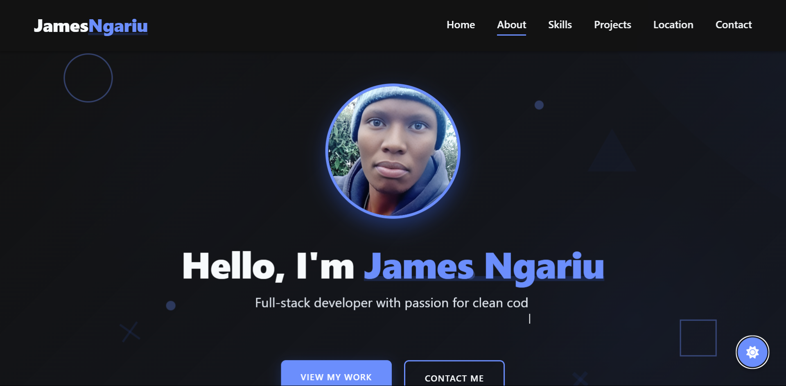

# Clean Portfolio Website

A professionally designed, responsive portfolio website built with modern web standards and best practices. Perfect for showcasing your skills, projects, and professional information to potential clients and employers.



## Live Demo

[View Live Demo](https://jamesngariu.com)

## Features

- **Clean, Modern Design**: Elegant user interface with attention to typography, spacing, and visual hierarchy
- **Fully Responsive**: Optimized for all screen sizes from mobile to desktop
- **Dark/Light Mode**: User-selectable theme with persistence via localStorage
- **Smooth Animations**: Tasteful animations and transitions for an enhanced user experience
- **Interactive Components**: 
  - Mobile-friendly navigation
  - Project showcase with detailed popup views
  - Contact form with validation and email integration via Formspree
  - Interactive map for location
  - FAQ accordion
  - Back-to-top button
  - Auto-typing animation
  - Background animations and visual elements
- **Services Showcase**: Highlight your professional services with interactive cards and hover effects
- **Work Process Flow**: Visual representation of your work methodology with numbered steps
- **Accessibility**: Follows WCAG guidelines with proper semantic markup, ARIA attributes, and keyboard navigation
- **SEO Optimized**: Includes proper meta tags, Open Graph protocol, structured data, and semantic HTML
- **Performance Optimized**: Lightweight and fast-loading with optimized assets

## Project Structure

```
clean-portfolio/
├── assets/
│   ├── css/
│   │   ├── styles.css       # Main styles and variables
│   │   ├── components.css   # Component-specific styles
│   │   └── responsive.css   # Media queries for responsive design
│   ├── js/
│   │   └── main.js          # Site functionality
│   └── images/              # Image assets
├── index.html               # Main HTML file
├── services.html            # Services showcase page
├── robots.txt               # Instructions for search engine crawlers
├── sitemap.xml              # Site structure for search engines
└── README.md                # Project documentation
```

## Technologies Used

- HTML5
- CSS3 (Flexbox, Grid, Custom Properties)
- JavaScript (ES6+)
- [Font Awesome](https://fontawesome.com/) for icons
- [Google Fonts](https://fonts.google.com/) for typography
- [Typed.js](https://github.com/mattboldt/typed.js/) for typing animation
- [Formspree](https://formspree.io/) for contact form submissions

## Getting Started

### Prerequisites

- A modern web browser
- Basic understanding of HTML, CSS, and JavaScript (for customization)

### Installation

1. Clone the repository:
   ```
   git clone https://github.com/jamesngariu/clean-portfolio.git
   ```
   
2. Navigate to the project directory:
   ```
   cd clean-portfolio
   ```

3. Open `index.html` in your browser or use a local development server.

## Deployment

This site is ready to deploy on any static hosting service:

### GitHub Pages

1. Create a new GitHub repository
2. Push your code to the repository
3. Go to Settings > Pages
4. Select the main branch as your source
5. Your site will be published at `https://yourusername.github.io/repositoryname/`

### Netlify, Vercel, or other static hosts

1. Create an account on your preferred hosting service
2. Follow their instructions for deploying a static site
3. Connect your GitHub repository or upload the files directly

## Customization

### Personal Information

Update the content in `index.html` and `services.html` to include:
- Your name and profession
- About section information
- Skills and technologies
- Project details and screenshots
- Services you offer with descriptions
- Your work process methodology
- Contact information

### Services Section

The services section can be customized in `services.html`:
1. Update the service cards with your own offerings
2. Modify the icons using Font Awesome classes
3. Update the service descriptions to match your expertise
4. Customize the "Get Started" links to point to your contact form

### Work Process

The work process section can be customized to reflect your own methodology:
1. Update the step numbers and titles
2. Modify the descriptions for each step
3. Add or remove steps as needed to match your workflow

### Theme and Styling

The color scheme and theme variables can be modified in the `:root` section of `styles.css`. The website uses CSS variables for consistent theming:

```css
:root {
  --primary-color: #3563E9;
  --primary-dark: #2447C0;
  --primary-hover-color: #2447C0;
  /* other variables */
}
```

### Formspree Integration

1. Create an account at [Formspree](https://formspree.io/)
2. Create a new form and get your form ID
3. Replace `mpwpjnbq` in the form action URL with your own form ID:
   ```html
   <form id="contactForm" action="https://formspree.io/f/your-form-id" method="POST">
   ```

### Images

Replace the placeholder images in the `assets/images/` directory with your own images. Recommended:
- Professional headshot for the profile image
- High-quality screenshots for project images
- Optimized images for faster loading

## Browser Support

The website is compatible with all modern browsers:
- Chrome (latest)
- Firefox (latest)
- Safari (latest)
- Edge (latest)

## License

This project is available under the MIT License. See the [LICENSE](LICENSE) file for more information.

## Acknowledgments

- Icons by [Font Awesome](https://fontawesome.com/)
- Fonts by [Google Fonts](https://fonts.google.com/) (Poppins & Raleway)
- Typing effect by [Typed.js](https://github.com/mattboldt/typed.js/)
- Form processing by [Formspree](https://formspree.io/)

---

## Author

**James Ngariu**
- Website: [jamesngariu.com]([https://github.com/jmooreCodes/jamesngariu_website/)
- GitHub: [@jmooreCodes](https://github.com/jmooreCodes)
- LinkedIn: [James Ngariu](https://linkedin.com/in/james-ngariu)

---

*This project was built as a showcase of frontend development skills and best practices. Feel free to use it as a template for your own portfolio.*

### Adding Your Resume

To enable the "Download CV" button:

1. Create an HTML version of your resume/CV (or edit the provided template)
2. Save it as `john-doe-resume.html` (or choose another name)
3. Place it in the `assets/files/` directory
4. If you renamed the file, update the download link in `index.html`:
   ```html
   <a href="assets/files/your-filename.html" class="btn secondary-btn" download>
   ```

The HTML resume format ensures cross-browser compatibility and proper rendering of your resume when downloaded. The template includes responsive styling for both screen viewing and printing.
